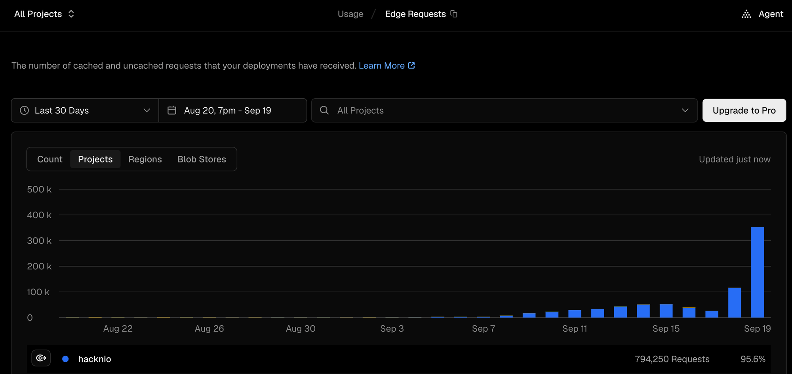

# hacknio

hacknio is a lightweight Hacker News client created with React and Next.js, designed to deliver a fast and responsive user experience. You can navigate between pages using the arrow keys for added convenience!


## Tech Stack

- **Frontend:** React, Next.js, Tailwind CSS
- **API:** Hacker News API

## Getting Started

To run the project locally, follow these steps:

1. **Clone the repository:**
   ```bash
   git clone https://github.com/ni5arga/hacknio.git
   cd hacknio
   ```

2. **Install dependencies:**
   ```bash
   npm install
   ```

3. **Run the development server:**
   ```bash
   npm run dev
   ```

4. **Open your browser and navigate to:**
   ```
   http://localhost:3000
   ```

## Use with Docker

To run hacknio using Docker:

1. **Build and start the container:**
   First, cd into the top directory of the `hacknio` repo.

   Then do...

   ```bash
   docker compose up -d --build
   ```

2. **Access the application:**
   Open your browser and navigate to `http://localhost:3000`

3. **Stop the container:**
   ```bash
   docker compose down
   ```

Note: The default port is 3000. To use a different port, set the `HOST_PORT` environment variable before running docker compose or include the environment variable in an adjacent `.env` file.

## Contributing

Contributions are welcome! If you have suggestions or issues, please create an issue in the GitHub repository.

## License

This project is licensed under the MIT License - see the [LICENSE](LICENSE) file for details.

## Acknowledgments

- [Hacker News API](https://github.com/HackerNews/API) for providing the data.

---

## deployment is paused, please self host

the hosted instance is off. hacknio is a self-host-only project now.

to get this out of the way first: i can afford it. easily. the bill was never the problem and i would have kept paying it without thinking about it.

the actual reason is that one shared instance is the wrong shape for what this is. the shared part is what makes it worse for everyone using it, and honestly it was always a little weird that i was the one hosting it. i use other hn clients every day. i built this, i like it, and i still open something else most mornings. me being the single point of failure for a few thousand people's hn reading never really made sense.

here is the last 30 days before i pulled it. 794,250 edge requests, 95.6% of everything on my account, and roughly 350k of that on sep 19 alone:



why that is your problem and not just mine:

- hobby includes 1,000,000 edge requests a month. i used 79% of that in one 30 day window and the curve was still going straight up ([hobby plan limits](https://vercel.com/docs/plans/hobby)).
- going over does not throttle you, it stops you. vercel: "in most cases, if you exceed your usage limits on the Hobby plan, you will have to wait until 30 days have passed before you can use the feature again" ([hobby billing cycle](https://vercel.com/docs/plans/hobby#hobby-billing-cycle)). one bad week takes the site dark for a month, for everybody, including you.
- spikes hurt before the quota does. functions burst at 1000 concurrent executions per 10 seconds per region and the scale up "may take several minutes during traffic surges" — past it you get `503 FUNCTION_THROTTLED` ([concurrency scaling](https://vercel.com/docs/functions/concurrency-scaling), [FUNCTION_THROTTLED](https://vercel.com/docs/errors/function_throttled)). a sep 19 shaped day is exactly that shape.
- hobby is "non-commercial personal use only" ([fair use](https://vercel.com/docs/limits/fair-use-guidelines#commercial-usage)). a public instance a few thousand people lean on daily stopped being personal a while ago.
- and the shared instance buys you nothing anyway. hacknio is a client app — `src/app/utils/api.ts` hits the [hn firebase api](https://github.com/HackerNews/API) straight from your browser, one request per item. front page is 1 list call plus 10 item calls, a story page is 1 plus one per comment. that happens in your browser whether the html came from my deployment or yours. sharing my instance does not save you a single hn request. it only pools everyone into one quota that one traffic spike can burn down.

self hosting fixes the whole list at once. your own allowance, your own region, your own cache, and my traffic curve stops being something you have to survive.

also, and i mean this, self hosting is fun. you get a thing that is yours, on a box or an account you control, that nobody can take down or rate limit out from under you. you can change the page size, rip out the parts you do not use, restyle the whole thing. that is a much better relationship to have with a hn client than refreshing someone else's url and hoping it is up.

takes about two minutes:

- **local** — the getting started steps above.
- **docker** — the docker steps above.
- **your own vercel / netlify / whatever** — fork it and point your provider at the fork. no api keys, no env vars, nothing to configure. it talks to the public hn api directly.

repo stays open, issues and prs still welcome. thanks to everyone who used it. i did not expect this thing to go anywhere.
